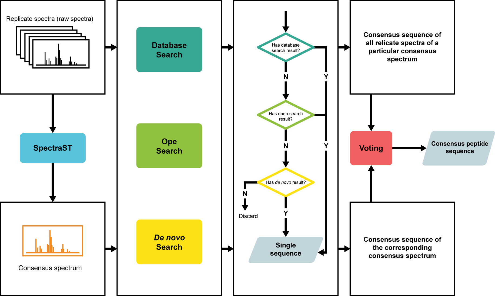

# metaSpectraST

  

metaSpectraST is an unsupervised and database-independent analysis tools for metaproteomic MS/MS data using spectrum clustering. It clusters all experimentally observed MS/MS spectra based on their spectral similarity and create a representative consensus spectrum for each cluster by using the spectrum clustering algorithm implemented in the spectral library search engine, [SpectraST](http://tools.proteomecenter.org/wiki/index.php?title=Software:SpectraST). 

Spectrally similar MS/MS spectra that are grouped in one spectral cluster are presumed to originate from the sampe peptide sequence, and therefore metaSpecraST treats them as replicate spectra and quantitatively profiles samples by counting the number (spectral count, SC) or intentisity (spectral index, SI<sub>N</sub>) of replicate spectra in each spectral cluster.

The metaSpectraST spectral clusters also offer a portal to integrate and reconcile multiple peptide identification approacheds, including database search, open modification search, and *de novo* sequencing. For each spectral cluster, sequences of raw spectra and their cosensus spectrum assigned by different indentification methods vote for the consensus peptide sequence of the spectral cluster through a heuristic reconciliation scheme and the majority rule.

With metaSpectraST you can,

1. Fast profile and compare the microbial communities of your sample;
2. Classify your metaproteomic (or proteomic) samples;
3. Validate biological/technical replicates;
4. Integrate and reconcile multiple peptide/protein identification approaches for further taxonomic or functional studies.

# Contents
- [Installation](https://github.com/bravokid47/metaSpectraST/edit/main/README.md#installation)
  - [Dependencies](https://github.com/bravokid47/metaSpectraST/edit/main/README.md#dependencies)
  - [Installing metaSpectraST](https://github.com/bravokid47/metaSpectraST/edit/main/README.md#installing-metaspectrast)
- [Quick start]()
  - [Data format]()
  - [Modules of metaSpectraST]()
  - [Step 1: performing spectral clustering]()
  - [Step 2: profiling samples]()
  - [Step 3: classifying samples and visulization]()
  - [Reconciliation scheme]()
- [About]()

# Installation
## Dependencies
- **Python version >= 3.7, R version 4.1.3**
- **SpectraST (v5.0)**

[SpectraST](http://tools.proteomecenter.org/wiki/index.php?title=Software:SpectraST) is an integral component of the [Trans Proteomic Pipeline suite (TPP)](http://tools.proteomecenter.org/wiki/index.php?title=Software:TPP) of software. A compiled executable file is included here, which can be used alone without other TPP components.

We encourage useres to download and install the entire TPP suite, which provides other useful functionaliteissuch as raw data importation, automatic validation of search results, protein inference, and quantification and visualization. Please refer to the guides for [TPP Linux installation](http://tools.proteomecenter.org/wiki/index.php?title=Linux_Installation_Guides), and the official download site for [Windows installer](http://tools.proteomecenter.org/wiki/index.php?title=TPP:5.2_Installation).

- **edgeR (v3.34.0)**

metaSpectraST normalizes the data using the trimmed mean of M-values (TMM) normalization method implemented in the edgeR package. edgeR is not necessary if you would like to normalize the data with other methods. Please refer to [Bioconductor-edgR](http://www.bioconductor.org/packages/release/bioc/html/edgeR.html) for further information.

To install the edgeR package, start R and enter:

```R
if (!require("BiocManager", quietly = TRUE))
    install.packages("BiocManager")

BiocManager::install("edgeR")
```

You may also need to install the **limma** (v3.48.1) package

```R
if (!require("BiocManager", quietly = TRUE))
    install.packages("BiocManager")

BiocManager::install("limma")
```

## Installing metaSpectraST
1. Download or clone the repository:

```shell
git clone https://github.com/bravokid47/metaSpectraST.git
```

2. Make metaSpectraST executable by adding the directory ```yourpath/metaspectrast/``` to the environment variable ```$PATH```, or just copy the following line to the ```~/.bashrc``` or ```~/.bash_profile``` file and ```source``` the file.

```shell
export PATH="$PATH:yourpath/metaspectrast";
```
# Quick start
## Data format
metaSpectraST can perform spectral clustering from the following data formats:
- mzML format
- mzXML format
- mgf format

Please note that mgf format is required for computing the normalized spectral index (SI<sub>N</sub>). File formats can be converted with [msconvert](https://proteowizard.sourceforge.io/tools.shtml) or [ThermoRawFileParser](https://github.com/bravokid47/ThermoRawFileParser).

## Modules of metaSpectraST
There are 6 individual modules in metaSpectraST. Run the following command to get explanation of the 6 modules.

```shell
metaspectrast -h
```

Output
```
>>>
_________ metaSpectraST by Hao, Chunlin _________

metaSpectraST v=0.0
Usage: metaspectrast [module]

Module:
1  cluster          Clustering MS/MS spectra and create consensus spectra
2  computesc        Spectral count-based (SC) sample profiling
3  computesin       Normalized spectral index (SIn) based sample profiling
4  normalize        Normlizing the data matrix of sample profiles (SC or SIn)
5  classify         Hierarchically clustering and classifying samples
6  reconcile        Reconciliation scheme
```
Each module is run separately. For example, to run the ```computesin``` module,

```shell
metaspectrast computesin -h
```

Output
```
>>>
usage: metaSpectraST_SIn.py [-h] [-s [SPTXT]] -m MGF [MGF ...]

metaSpectraST (v0.0) by Hao, Chunlin.
Compute normalized spectral index (SIn) of cnsensus spectra.

optional arguments:
  -h, --help        show this help message and exit
  -s [SPTXT]        consensus spectra .sptxt file, grandConsensus.sptxt by default.
  -m MGF [MGF ...]  raw spectra data sets in MGF format
```

## Step 1: performing spectral clustering
Run the following command to perfom spectral clustering:

```shell
metaspectrast cluster <path/*mzML>
```

Fragmentation type (ETD, HCD, CID-QTOF) of the spectra can be specified by the ```-i``` option. Default is off and the fragmentation type can be determined from the data files.

```shell
metaspectrast cluster -i HCD <path/*mzML>
```

When this step is done, it produces three types of output file in the working directory. The file ```bar.splib``` is the spectra library in a binary format. The ```bar.sptxt``` is a human-readable version of the bar.splib. The files ```bar.spidx``` and ```bar.pepidx``` are indices on the precursor m/z value and peptide, respectively. The file ```grandConsensus.sptxt``` is the library of consensus spectra, which will be used in the subsequent steps. A library of consensus spectra in .mgf format is also produced, named as ```grandConsensus.mgf```.

## Step 2: profiling samples
Consensus spectrum created in step 1 can be quantified by counting the the number (spectral count, SC) or intentisity (spectral index, SI<sub>N</sub>) of the replicate spectra (raw spectra) in the corresponding spectral cluster in the sample. Quantified consensus spectra can then be used to profile the samples.

**Spectral count-based (SC) profiling**

```shell
metaspectrast computesc -s <path/grandConsensus.sptxt>
```

When it is done, it produces two CSV files, ```unnorm_consensusPep_SC.csv``` and ```consensusSpec_RawSpectra_idx.csv```. The file unnorm_consensusPep_SC.csv is unnormalized spectral count of consensus spectra in each sample, which can be normalized by the ```normalize``` module (see [Step 3]()) or simply normalized by the sum of the spectral count in each data set. The file consensusSpec_RawSpectra_idx.csv is the index of the correspondence of raw spectrum and its consensus spectrum.

**Normalized spectral index-based (SI<sub>N</sub>) profiling**

```shell
metaspectrast computesin -s <path/grandConsensus.sptxt> -m <path/*mgf>
```
Note that the .mgf file has to be named the same as the the corresponding input file in [Step 1](). 

When it is done, it produces three CSV files, ```unnorm_consensusPep_SI.csv```, ```consensusPep_SIn.csv``` and ```consensusSpec_RawSpectra_idx.csv```. Similar to SC profiling, the file unnorm_consensusPep_SI.csv is unnormalized spectral index of consensus spectra in each sample, which can be normalized by the ```normalize``` module (see [Step 3]()). The file consensusPep_SIn.csv is the same file as unnorm_consensusPep_SI.csv, but normalized by the sum of the spectral index in each data set. The file consensusSpec_RawSpectra_idx.csv is the index of the correspondence of raw spectrum and its consensus spectrum.

## Step 3: classifying samples and visulization
Hierarchical clustering of samples can be performed based on their SI<sub>N</sub> or SC profiles. But before that, SI<sub>N</sub> or SC profiles need to be normalized.

### Normalization
Normalization of the SI<sub>N</sub> or SC profiles can be performed by simply diving by the sum of the SI<sub>N</sub> or SC in each data set. Note that the file ``` consensusPep_SIn.csv``` can be used for hierarchical clustering directly as it has been normalized by the sum of the SI<sub>N</sub> in each data set already. Alternatively, run the following command to normalize the SI<sub>N</sub> or SC profiles. The ```normalize``` module normalizes the data using the trimmed mean of M-values (TMM) normalization method implemented in the edgeR package.

```shell
metaspectrast normalize -u unnorm_consensusPep_SI.csv
```

The normalized file is named as ```tmmNorm_consensusPep.csv```. The scaling factor of each data set can be found in the file ```tmm_scalingFactor.csv```.

### Hierarchical clustering
Run the following command to perform the hierarchical clustering on samples.

```shell
metaspectrast classify -n tmmNorm_consensusPep.csv
```

If you are working with microbial communities in or on a host organism, such as gut microbiome, you could exclude the consensus spectra of the host peptides by providing metaSpectraST a .txt file containing containing a single column of the full name of the consensus spectra that need to be excluded. Consensus spectra of host peptides can be identified by database search of the consensus spectra library (```grandConsensus.mgf```) against the host proteome database.

```shell
metaspectrast classify -n tmmNorm_consensusPep.csv -r removal.txt
```

Further refinement of the SI<sub>N</sub> or SC profiles can be conducted through the ```-o``` option, which specifies the minimum number of samples that a consensus spectrum has to be observed in. This opiton can help filter out the singly or rarely observed consensus spectra. Default is 1.

```shell
metaspectrast classify -n tmmNorm_consensusPep.csv -r removal.txt -o 3
```

At the end of the day, two figures are produced. One is the file ```hierarchicalHeatmap.png```, which is a heatmap with some decorations showing the clusters of the samples. The other is the file ```dendrogram.png```, which is a dendrogram of the clusters of the samples.

## Reconciliation
Peptide sequences of raw spectra and consensus spectra can be identified thorugh multiple peptide identification methods, including database search, open modification search, and *de novo* sequencing. Replicate spectra and the consensus spectrum in one spectral cluster may be identified as conflicting peptide sequences by different identification methods. The ```reconcile``` module employs a heuristic reconciliation scheme to resolve the conflicts and correct seqeunce errors.

**Reconciliation scheme**



**Prepareing identification results**

To run the ```reconcile``` module, you need to prepare the identification results first. It's very simple. You just need to organize the identification results of raw spectra as CSV files containing at least two columns, ```RawSpectrum``` and ```peptide```. The 'RawSpectrum' column lists the recorded name of each raw spectrum, while the 'peptide' column lists the peptide sequence assigned to each raw spectrum. If the identification method provides protein information, you can add it as an additional column with the header of ```protein```. Identification results from different identification methods should be organized as separate CSV files. For identification results of consensus spectra, please change the header ```RawSpectrum``` to ```consensusSpec```.

Then run the following command to start the reconciliation procedure.

```shell
metaspectrast reconcile -d raw_DB.csv -t raw_taggraph.csv -n raw_denovo -c consensus_DB.csv -i consensusSpec_RawSpectra_idx.csv
```

Option arguments
```
  -d      Specifies the result of database search of raw spectra.
  -t      Specifies the result of open modification of raw spectra.
  -n      Specifies the result of de novo sequencing of raw spectra.
  -c      Specifies the result of database search of consensus spectra.
  -i      Specifies the index of correspondence of raw spectrum and its consensus spectrum.
          By default, 'consensusSpec_RawSpectra_idx.csv' generated automatically by the 'computesc' or 'computesin' module will be used.
```

# About
Author: Hao, Chunlin

Principle Investigators: Henry H. N. Lam (HKUST), Patrick K. H. Lee (CityU), and Joshua Elias (CZ Biohub).

## How to cite

